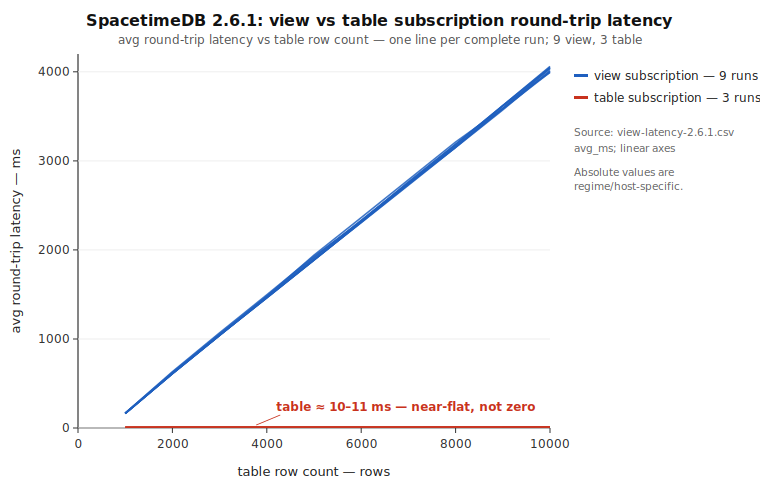

# View vs table subscription latency on SpacetimeDB 2.6.1 — retest

**Question.** Does the differential this repository documents on 1.11.3 and 2.2.0 — round-trip latency growing with table row count under a *view* subscription while a *table* subscription stays flat — still occur on official SpacetimeDB **2.6.1**?

**Answer.** Yes. In this repository's exact concurrent workload, view-subscription latency grows approximately linearly with row count while table-subscription latency stays approximately flat.

This report is behavioral only. It does not identify a mechanism, prove any asymptotic server complexity, locate the cost in the SDK versus the server, or make a controlled cross-version speed comparison.

## Setup

- **Module (unchanged):** the `messages` table, a trivial pass-through `messages_view` (`ctx.from.messages()`), and the `append_message` reducer.
- **Client (unchanged):** `roundtrip_latency_test`, `BATCH_SIZE = 1000 × NUM_BATCHES = 10 = 10,000` `append_message` calls, measuring the round trip from reducer call to its appearance in the active subscription. The original **concurrent** path is used: all 1,000 appends in a batch are in flight at once. **Confirmed reads are on** (the 2.6.1 default), so each measured latency includes the confirmation round trip.
- **Doses:** ten cumulative points, 1,000 → 10,000 rows (one per batch).
- **Arms:** `--subscribe-to view` and `--subscribe-to table`, each from a **fresh database** (`spacetime publish … --clear-database` before the arm; every run's first dose is at 1,000 rows).
- **Versions:** SpacetimeDB standalone, SDK, and CLI all **2.6.1** (official release; embedded release commit `052c83f…`, cited as release-build provenance, not a source build to reproduce). Measurements were taken against a local standalone 2.6.1 server.
- **Metric.** All derived numbers below — slopes, R², monotonicity, representative-run selection, ratios, and the figure — use the `avg_ms` column. Reported **CV is the population standard deviation divided by the mean across the complete observed run set** (these runs are the full observed set being described, not a sample of a larger population).

## Results

**Observation.** All nine complete view trajectories rise approximately linearly with row count; all three table trajectories stay approximately flat.

**Interpretation.** The behavioral differential this repository documents remains reproducible on 2.6.1 in the exact concurrent regime.

**Non-claim.** No internal mechanism, asymptotic complexity, SDK-vs-server locus, or controlled 2.2.0-vs-2.6.1 magnitude claim is established here.

Aggregate over 9 view runs and 3 table runs (each 10 doses; every number recomputable from [`data/view-latency-2.6.1.csv`](data/view-latency-2.6.1.csv)):

| Arm | Mean @ 1,000 rows | Mean @ 10,000 rows | Per-run slope | Linear fit | Replication |
|---|---:|---:|---:|---:|---:|
| view  | ~164.4 ms (CV 1.1%) | ~4,027 ms (CV 0.6%) | ~427 ms / 1,000 rows (CV 0.45%) | R² > 0.999 in all 9 | 9/9 strictly monotone |
| table | ~10.0 ms | ~11.5 ms | 0.06–0.19 ms / 1,000 rows | R² 0.13–0.60, no material trend | 3 runs |

The view arm is ~16× the table arm at 1,000 rows and ~350× at 10,000 rows — an arm-specific end-to-end latency differential, not a mechanism signature. The nine view runs are **9 attempts across 3 repetitions** (three temporally adjacent attempts per repetition); attempts within a repetition share host conditions and are not independent replicates.



*Figure: `avg_ms` vs row count, linear axes, one line per complete run (9 view, 3 table), derived only from the CSV. The table series is near-flat at ~10–11 ms — near the axis, not zero.*

Representative runs (the **median-slope** run within each arm; full traces and all other runs in the CSV):

View — run `view_r3_a3`:
```
=== SUMMARY ===
 Total messages     Avg (ms)     P50 (ms)     P99 (ms)
      1000       163.20       127.82       458.33
      2000       612.37       577.79      1349.10
      3000      1043.35      1009.40      2198.83
      4000      1469.01      1435.60      3038.12
      5000      1891.45      1858.49      3877.35
      6000      2321.13      2281.45      4735.02
      7000      2741.87      2707.43      5561.73
      8000      3157.72      3127.34      6387.80
      9000      3589.59      3557.09      7245.89
     10000      4038.45      4001.43      8138.07
```

Table — run `table_r1`:
```
=== SUMMARY ===
 Total messages     Avg (ms)     P50 (ms)     P99 (ms)
      1000        10.33        10.23        14.70
      2000        10.83        11.29        15.15
      3000        10.69        10.36        14.95
      4000        11.13        10.49        15.81
      5000        11.25        11.54        15.68
      6000        11.60        11.40        15.68
      7000        10.89        10.71        15.00
      8000        11.00        10.79        15.57
      9000        10.57        10.83        15.30
     10000        11.58        10.90        15.93
```

### Sampling and admission disclosure

The nine view trajectories exist because three repetitions each reached a cap of three complete attempts under an operational retry rule; **every complete attempt is included and none were discarded.** The three table trajectories are the complete table repetitions, admitted on their first attempts. All nine view attempts functionally completed through ten doses and 10,000 rows, but none were admitted by the original operational rule: **five failed its cumulative-swap threshold and four carried its mid-window external-load contamination flag.** That rule was built to gate trust in *absolute* latency — a different question than the shape/existence question here. Its cumulative-swap threshold was measured over the whole arm window and so scales with arm duration, statistically entangling admission with the very latency being measured (short table arms and much longer view arms were not comparable under it); this explains the five swap rejections, not the four external-load flags. The shape observation survives on CSV-auditable evidence: the nine complete view curves — including the four load-flagged attempts — agree closely across runs (population CV 0.45% in per-run slope, 0.59% at the 10,000-row endpoint, and 1.13% at the 1,000-row endpoint); run `view_r1_a1` was quiet throughout under the measured idle/PSI/compiler metrics, was rejected only by cumulative swap, and lies within the common envelope; and the table arm is an arm-specific negative control. Unmeasured host factors are not causally excluded, and shared-host external compile load may inflate absolute latency by an unknown factor.

## Limitations

- **Single shared host** under external compile load; the two arms were **not run simultaneously**.
- **Absolute values are regime- and host-specific** and are plausibly inflated by an unknown factor; only the within-run shape and the arm differential (including the ~16×/~350× ratios) are claimed.
- **Client round trips do not identify a mechanism** and do not decompose queueing, subscription update, cache update, and view evaluation. The concurrent 1,000-in-flight regime is part of the measured end-to-end workload; its costs are not separated out.
- **No controlled cross-version magnitude claim.** Absolute numbers in this repository's different version sections came from different environments and are not a controlled 2.2.0-vs-2.6.1 benchmark.

## Reproduce

Prerequisites: a Rust toolchain with the `wasm32-unknown-unknown` target, the SpacetimeDB **2.6.1** CLI, and an official SpacetimeDB **2.6.1** standalone server.

> Build note: `run_setup.sh` builds a wasm module. This repository's `Cargo.lock` includes a targeted transitive update, `ethnum 1.5.2 → 1.5.3`, needed to compile under current stable Rust (`rustc 1.97.0` rejects `ethnum 1.5.2` with `E0512`). `ethnum 1.5.3` is a patch release; it is not a change to this repository's own code.

From a clean checkout, with a 2.6.1 standalone server running (pass `--server <url>` if it is not the default):

```bash
# 1. Build module, generate bindings, build the client:
./run_setup.sh

# 2. View subscription (latency grows with row count):
spacetime publish view-latency --bin-path target/wasm32-unknown-unknown/release/module.wasm --clear-database --yes && \
  ./target/release/roundtrip_latency_test --subscribe-to view

# 3. Table subscription (latency stays flat), from fresh database state:
spacetime publish view-latency --bin-path target/wasm32-unknown-unknown/release/module.wasm --clear-database --yes && \
  ./target/release/roundtrip_latency_test --subscribe-to table
```

Each arm prints a ten-row `=== SUMMARY ===` block through 10,000 messages. The signal is the shape difference between the arms: view `avg_ms` rises steeply with row count while table `avg_ms` stays approximately flat. Absolute magnitudes depend on the host and regime and are not expected to match the aggregate above.
